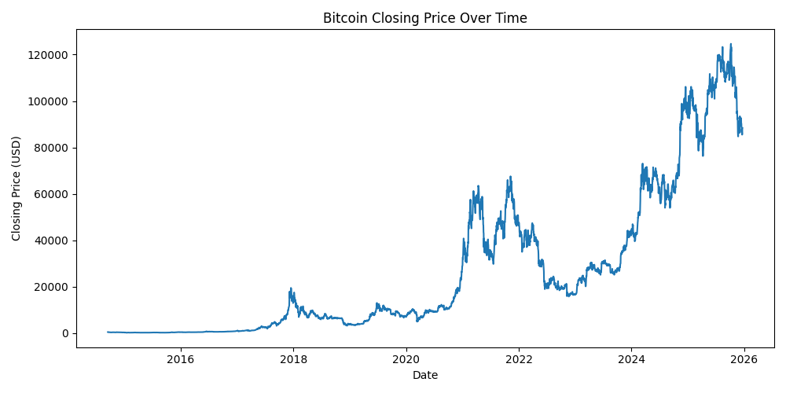
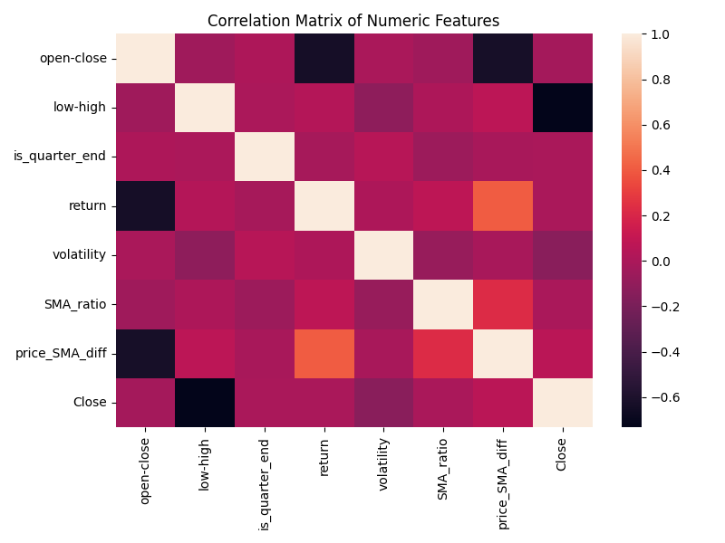
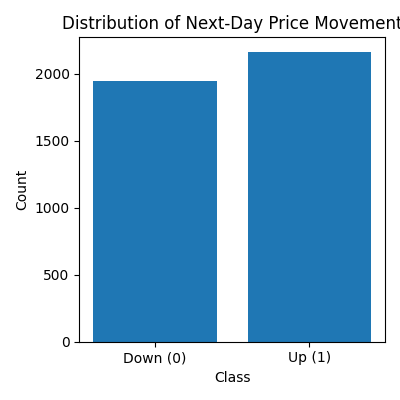
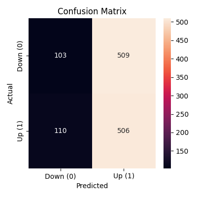
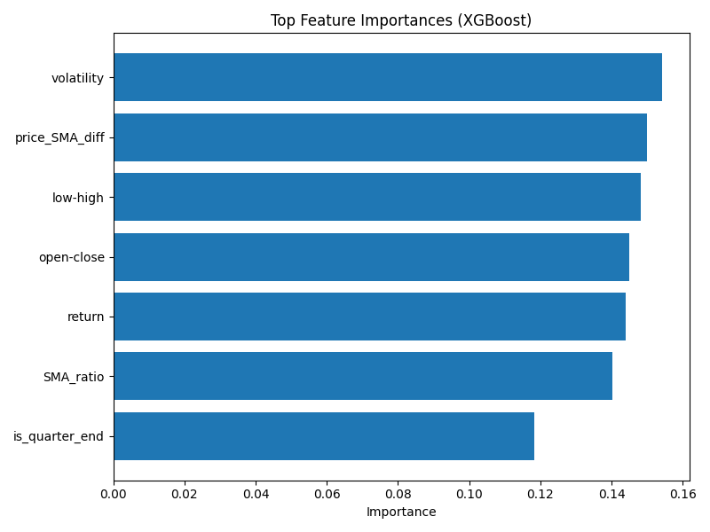
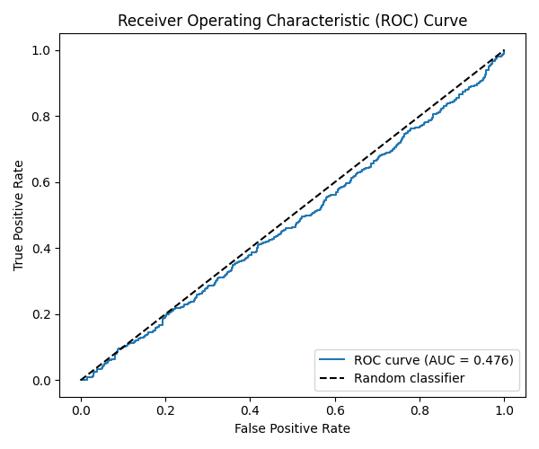

# 🚀 Bitcoin Price Prediction Project

## 📌 Description

This project analyzes Bitcoin price data and predicts future trends using Machine Learning.

It includes:

* Data preprocessing
* Data visualization
* Classification models
* Forecasting

---

## 🛠️ Technologies

* Python
* Pandas
* NumPy
* Scikit-learn
* XGBoost
* Matplotlib

---

## 📊 Visualizations

### 📈 Price Trend



### 🔥 Correlation Matrix



### 🎯 Target Distribution



### 🤖 Confusion Matrix



### 📊 Feature Importance (XGBoost)



### 📉 ROC Curve



---

## ▶️ How to Run

```bash
pip install -r requirements.txt
python main.py
```

---

## 📂 Project Files

* main.py → run project
* data_preprocessing.py → data cleaning
* classification.py → ML models
* forecasting.py → prediction
* plotting.py → visualization

---

## 👩‍💻 Author

Douha Oussaid
